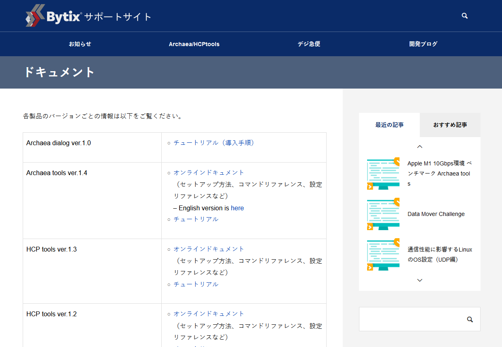

---
## オミクスデータグラフ化ツール 「RIAS®️ Visualization」の 提供を始めました {#rias_omics_viz_available}

:::danger

Rhelixa Graphing Tool（RIAS Visualization）は、2025年10月末をもちまして、サービス提供を終了いたします。

詳細は、以下をご参照ください。
- [「Rhelixa Graphing Tool（RIAS Visualization）2025年10月末 提供終了のお知らせ」](/blog/2025-09-29-news_Rhelixa-rias-visualisation-end-october-2025)

:::

2023.10.26

国立遺伝学研究所と包括連携協定を結ぶ株式会社Rhelixa（代表取締役：仲木 竜）より、オミクスデータグラフ化ツール Visualization が提供され、遺伝研スーパーコンピュータの利用者は無料で試用できるようになりました。

### Visualization の概要 {#overview-of-visualization}

Visualization は複雑なセッティングやプログラミングをすることなく、RNA-seqデータをはじめとするオミクスデータをグラフ化できます。データの全体傾向の把握の他、特定の因子（遺伝子等）に絞ってシグナルの傾向を可視化できます。

作成されたグラフは、論文や研究発表で自由にご利用いただけます。

作成できるグラフの種類は以下の 15 種類です。
- Violin Plot 
- Box Plot
- Heatmap
- Complex Heatmap
- Venn Diagram 
- 2D PCA Scatter Plot
- 3D PCA Scatter Plot
- Hierarchical Clustering
- Linear Regression
- Rotatable Scatter Plot
- Correlation Matrix
- Volcano Plot
- MA Plot
- Chord Diagram
- Network Analysis

### 利用方法 {#how-to-use}

「活用方法」の左側メニューから「Rhelixa Graphing Tool」を選んでください。

---

## ヒト全ゲノム解析の公共データの再解析データセット {#reanalysis_human_wga_public}

2023.06.05

公的データベースにオープンアクセスで公開されているヒトの全ゲノム解析データを再解析したデータを遺伝研スパコン上で共有します。

これらのデータは文部科学省新学術領域研究「 ゲノム配列を核としたヤポネシア人の起源と成立の解明」（ヤポネシアゲノム）の中で解析するために公的データベースからダウンロードし、遺伝研スパコンの中で再解析したものです。研究班終了後（2023 年 4 月〜）も広く研究に使える様にするために遺伝研スパコンの利用者向けに共有データとして保管することになりました。

データはいずれも SRA に登録されたオープンアクセスとなっています。サンプルの背景や利用の条件はオリジナルの論文を参照し利用者の責任で利用してください。

GRCh38 にマッピングした CRAM 形式のファイルと GATK4 または Parabricks の HaplotypeCaller アルゴリズムで解析した gVCF 形式のファイルを共有しています。

同等の解析内容が得られるパイプラインは下記から入手できます。

https://github.com/NCGM-genome/WGSpipeline

また、遺伝研スパコンからは以下の方法でデータセットを入手可能です。

 - 一般解析区画の全計算ノードについて、`/usr/local/shared_data/public-human-genomes/GRCh38/`の下にデータセットがマウントされているので遺伝研スパコン中の解析プログラムから直接アクセスして利用することが可能です。
    - 個人ゲノム解析区画については、現在準備中です。
- HTTPS: https://ddbj.nig.ac.jp/public/public-human-genomes/GRCh38/ 
- FTP: ftp.ddbj.nig.ac.jp/public-human-genomes/GRCh38

<table>
<tr>
<td>データセット</td>
<td>データソース</td>
<td>参考 URL</td>
</tr>
<tr>
<td>International 1000Genomes Project (100Genomes)</td>
<td>https://www.ebi.ac.uk/ena/browser/view/PRJEB31736</td>
<td>https://doi.org/10.1016/j.cell.2022.08.004</td>
</tr>
<tr>
<td>Human Genome Diversity Project (HGDP)</td>
<td>https://www.ebi.ac.uk/ena/browser/view/PRJEB6463</td>
<td>https://doi.org/10.1126/science.aay5012</td>
</tr>
<tr>
<td>Simons Genome Diversity Project (SGDP)</td>
<td>https://www.ebi.ac.uk/ena/browser/view/PRJEB9586</td>
<td>https://doi.org/10.1038/nature18964</td>
</tr>
<tr>
<td>Korean Personal Genomics Project (KPGP)</td>
<td>https://www.ebi.ac.uk/ena/browser/view/PRJNA284338</td>
<td>https://doi.org/10.1038/s41598-018-23837-x</td>
</tr>
</table>

---

## Archaea tools(旧 HCPtools) {#archaea-toolsformerly-hcptools}

2023.01.10

2022 年 10 月、HCPtools ソフトウェア提供元が、データ転送系のブランド名称として、「Bytix(バイティックス)」というブランド名を立ち上げ、製品名称が「HCPtools」から「Archaea tools」へ変更になりました。

変更についての詳細は、[&#x1f517;Bytix 公式ページ「製品名称変更等について」のページをご参照ください](https://support.bytix.tech/important/)。

製品名称変更後も、これまで通り HCPtools で使用していたコマンドと同じコマンドをそのままお使いいただけます。

また、Windows, Linux に加え macOS からも利用可能となりました。([&#x1f517;Bytix 公式ページ「対応プラットフォーム」をご参照ください](https://support.bytix.tech/docs/archaea/tools/1.4/A_overview/A09_platforms))。

Archaea tools(旧 HCPtools) の使い方は、[&#x1f517;Bytix 公式ページ「ドキュメント」のページをご参照ください](https://support.bytix.tech/document/)。

<table>
<tr>
<td width="400">

</td>
<td valign="top">
遺伝研スパコンに対してファイルのアップロード、ダウンロードを行うには、一般的に広く用いられているファイル転送ソフトウェアである`scp`や`sftp`をつかうことができますが、`scp`などでは遠距離間で大量のファイルを転送する際に転送速度が遅くなる性質があります。

遠距離の高速通信のために、遺伝研スパコンでは、一般解析区画では Aspera、個人ゲノム解析区画では Archaea tools(旧 HCPtools)というファイル転送ソフトウェアが利用可能となっています。

</td>
</tr>
</table>
