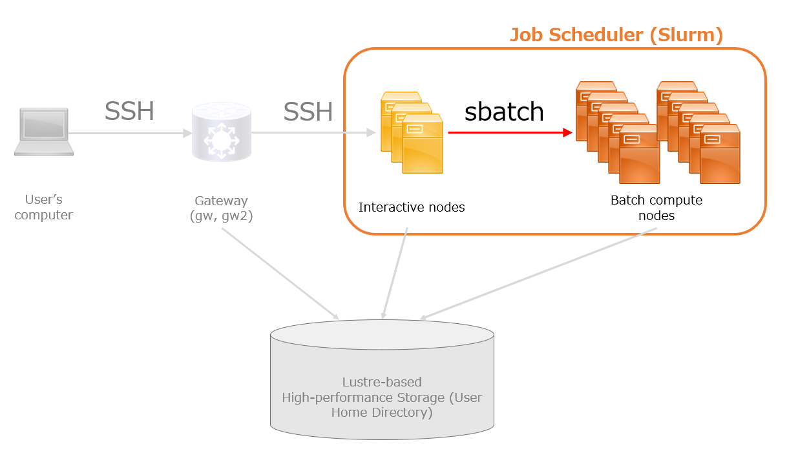

--- 
id: ga_slurm_partition
title: Slurmのパーティション(一般解析区画)
--- 

Slurmジョブスケジューラで管理された計算ノードはインタラクティブノードとバッチ計算ノードに大別されます。

- インタラクティブノード(interactive node)はユーザがプログラム開発や、小規模で短時間で終わる計算をその場で対話的に行うための計算機です。
- バッチ計算ノード(batch compute node)は、長時間かかる計算、大量の CPU やメモリを使う計算を行うための計算ノードです。

インタラクティブノード、バッチ計算ノードに対する計算要求（これをジョブと呼びます）は Slurm ではパーティションを用いて管理されます。計算要求量が計算機のリソース量を超えている場合は、ジョブはパーティションの中で待ち、計算機が空き次第Slurm により自動的に実行されます。

遺伝研スパコンの一般解析区画では、ノードを構成する計算機の種類ごとにSlurmパーティションが設けられています。

<table>
<tr>
<th>ノードの種別</th>
<th>Slurmパーティションの名称</th>
<th>ハードウェア種別</th>
<th>台数・合計コア数</th>
</tr>
<tr>
<td>
インタラクティブノード
</td>
<td>
login
</td>
<td>
HPC CPU最適化ノード Type 1 
(AMD EPYC9654, 192 CPU cores/node, 1536GB 
8GB memory/CPU core)
</td>
<td>
3 台・576 コア 
</td>
</tr>

<tr>
<td rowspan="6">バッチ計算ノード</td>
<td>epyc</td>
<td>
HPC CPU最適化ノード Type 1 
(AMD EPYC9654, 192 CPU cores/node, 1536GB 
8GB memory/CPU core)
</td>
<td>12 台・2304コア</td>
</tr>

<tr>
<td>rome</td>
<td>
HPC CPU最適化ノード Type2  
(AMD EPYC 7702, 128 CPU cores/node,  
4GB memory/CPU core)
</td>
<td>9 台・1152 コア</td>
</tr>

<tr>
<td>short.q</td>
<td>
HPC CPU最適化ノード Type 1 
(AMD EPYC9654, 192 CPU cores/node, 1536GB 
8GB memory/CPU core)
</td>
<td>1台・192コア</td>
</tr>

<tr>
<td>medium</td>
<td rowspan="2">
メモリ最適化ノード Type 2 
(AMD EPYC 9654, 192 CPU cores/node,  
16GB moemory/CPU core)
</td>
<td rowspan="2">2 台・384コア</td>
</tr>

</table>

Slurmの使い方は、[Softwareの「Slurmの使い方」のページをご参照ください](/guides/software/JobScheduler/Slurm/)。

