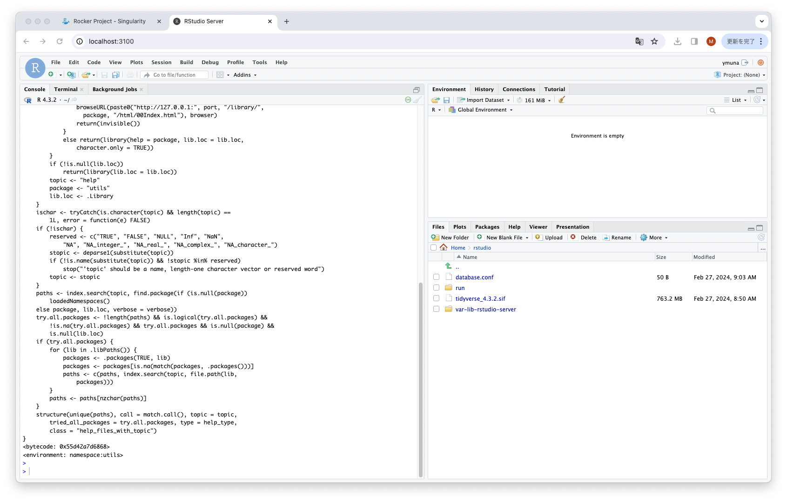

## How to Use RStudio Server in a User Environment {#how-to-use-r-studio-server-in-userenv}

RStudio Server is a web server-based RStudio environment (IDE). This document explains how to start the RStudio server environment within the National Institute of Genetics supercomputer. Unlike RStudio Desktop, RStudio Server is primarily a server application that runs on a server, making it difficult to manage the entire RStudio Server with conda. Therefore, this document demonstrates how to set up a user environment on the RStudio Server interactive node using Singularity containers.

## About the Rocker Project

The [Rocker Project](https://rocker-project.org/) provides integrated environments for RStudio Server as containers, maintaining and distributing the following container images:

| Image        | Description                                         |
|--------------|-----------------------------------------------------|
| r-ver        | Stable version of R and source build tools         |
| rstudio      | Adds RStudio to r-ver                               |
| tidyverse    | Adds tidyverse and devtools to RStudio              |
| verse        | Adds document creation packages like tex to tidyverse |
| geospatial   | Adds geographic information libraries to verse      |

[Article on Rocker Project (RStudio, tidyverse, verse, geospatial)](https://rocker-project.org/images/versioned/rstudio.html)

However, these images do not support Japanese.

Here, we will demonstrate how to create a RStudio Server environment accessible to general users using the tidyverse image. This article is based on the Rocker Project's
[Singularity - Run RStudio Server containers by Singularity.](https://rocker-project.org/use/singularity.html) and includes the following steps:
- Importing a Rocker Image (Docker Image) to Singularity
- Starting a Singularity container on the interactive node and setting up the rserver environment
- Configuring a method to connect to RStudio Server from outside of the National Institute of Genetics (ssh port forwarding)

## Importing Rocker Images

Rocker Project images are available as Docker images, but can be imported onto the interactive node of the National Institute of Genetics supercomputer as Singularity SIF images by following these steps. You may choose which version of the container to import, so please refer to the following page to decide which version to use:

- [Repository of Docker files published by the Rocker Project](https://github.com/rocker-org/rocker-versioned2/tree/master/dockerfiles)

This article demonstrates how to obtain the image for tidyverse version 4.3.2.
```
yxxxx@at139:~$ singularity pull docker://rocker/tidyverse:4.3.2
INFO:    Converting OCI blobs to SIF format
INFO:    Starting build...
Getting image source signatures
Copying blob 29202e855b20 done   | 
...
INFO:    Creating SIF file...
```
Confirm that an image file with the .sif extension is created in the current directory.

```
yxxxx@at139:~$ ls -l *sif
-rwxr-xr-x 1 yxxxx xxxxx 800317440 Feb 27 08:50 tidyverse_4.3.2.sif
```

## Starting a Singularity Container on the interactive node {#start-singularity-loginnode}

Start the imported Singularity image on the interactive node by following these steps.

Create a run directory and a directory for mounting var/lib under the home directory. Also, create a database configuration file. Here, we use sqlite as the database.
```
yxxxx@at139:~/rstudio$ mkdir -p run var-lib-rstudio-server
yxxxx@at139:~/rstudio$ printf 'provider=sqlite\ndirectory=/var/lib/rstudio-server\n' > database.conf 
yxxxx@at139:~/rstudio$ ls
database.conf  run tidyverse_4.3.2.sif  var-lib-rstudio-server

```
Next, identify the IP address of the interactive node where you logged in with qlogin.

```js
 yxxxx@at139:~/rstudio$ ip a |grep ib
...
    inet 172.19.aaa.bbb/20 brd 172.19.15.255 scope global ibp161s0
```
Note down the IP address 172.19.aaa.bbb.

On the interactive node, input the singularity exec command as follows. The options specified have the following meanings, and since it does not operate in the background, the prompt will not return. The window will be occupied while RStudio Server is running.

- `PASSWORD='xxxxxx'`: Specifies the password to use on the RStudio Server authentication screen.
- `--bind`: Specifies the mapping of directories on the home directory to be referenced inside the container. Here, the /run

 and /var/lib/rstudio-server directories inside the container, and the configuration file /etc/rstudio/database.conf are mapped.

Options specified for rserver are as follows:
- `--www-address`: Specifies the interactive node's IP address identified above.
- `--server-user`: Maps the server process user inside the container to the user in the environment. Specify your username.
- `--auth-none=0`: Enables user authentication for additional security.
- `--auth-pam-helper-path=pam-helper`: Specifies the auth-pam-helper.

```
PASSWORD='xxxxxx' singularity exec --bind run:/run,var-lib-rstudio-server:/var/lib/rstudio-server,database.conf:/etc/rstudio/database.conf  tidyverse_4.3.2.sif /usr/lib/rstudio-server/bin/rserver --auth-none=0 --auth-pam-helper-path=pam-helper --server-user=yxxxx --www-address=172.19.aaa.bbb
TTY detected. Printing informational message about logging configuration. Logging configuration loaded from '/etc/rstudio/logging.conf'. Logging to 'syslog'.
```
If the following error message is displayed and the server cannot start because another user on the same interactive node is already using the TCP port, try using a different port by adding the `--www-port` option.

```
2024-02-27T02:23:29.108062Z [rserver] ERROR system error 98 (Address already in use); OCCURRED AT rstudio::core::Error rstudio::core::http::initTcpIpAcceptor(rstudio::core::http::SocketAcceptorService<rstudio_boost::asio::ip::tcp>&, the string&, the string&) src/cpp/server/ServerInit.cpp:146; LOGGED FROM: int main(int, char* const*) src/cpp/server/ServerMain.cpp:766
```
To check if another user is using the intended port, use the command:

```
ss |grep 8787
tcp   ESTAB  0      0                                            172.19.xxx.xxx:8787       172.19.xxx.xxx:51900 
```

Additionally, RStudio server defaults to a 60-minute session timeout. To disable this, add the following options to the rserver:

```
--auth-timeout-minutes=0 --auth-stay-signed-in-days=30
```

## Setting Up SSH Port Forwarding {#setting-ssh-port-forward}

Open a terminal on your PC and execute the following command to set up ssh port forwarding. This assumes your PC is capable of using ssh.
```
yxxxx@xxxx ~ % ssh -l YourUserNameAtTheNationalInstituteOfGeneticsSupercomputer -N gw.ddbj.nig.ac.jp -L 3100:TheIPaddressIdentifiedAbove:8787
```
Specifying 3100 and the above command means forwarding the local PC's port 3100 to the remote server's port 8787. The number 3100 can be any number not used on your local PC. The default port number for rserver is 8787 if not specified with `--www-port`.

Enter the passphrase for the National Institute of Genetics supercomputer.
```
Enter passphrase for key '/Users/xxxxxx/.ssh/id_rsa': 
```
Leave this terminal open while connected to RStudio Server. After finishing with RStudio Server, you can stop it with Ctrl+C.

## Connecting to RStudio Server from a Terminal {#Connect-terminal-to-rstudio-server}

Open a browser on the terminal and navigate to `http://localhost:LocalPortNumberSpecifiedAbove (e.g., 3100)`. An authentication screen will appear.


Enter the specified username and password. Once logged in to RStudio Server, the screen will be displayed.



Please use the web interface. Projects created on the RStudio Server environment started with this Singularity container are located in the user's home directory.
