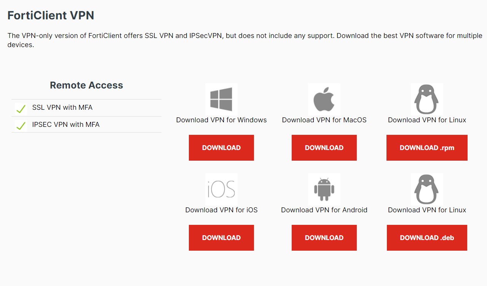
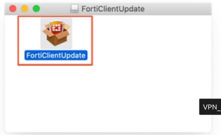

## Download the SSL-VPN client software "FortiClient" {#download-forticlient}

Click on the following URL to access the official ForiClient website page. You will see several software, of which download 'FortiClient VPN only'.

- FortiClient official website: [https://www.fortinet.com/support/product-downloads](https://www.fortinet.com/support/product-downloads)

For more detailed download instructions, see [FAQ](/guides/FAQ/faq_personal_genome/faq_forticlient/#how-to-DL-VPN).

## Install the SSL-VPN client software "FortiClient" {#install-forticlient}

1. Click "OK" to run it.

2. Double click on "FortiClientUpdate".

3. CLick "Open".

Downloading will be started. Please wait for a minute.

4. Click "install".

5. Click "Continue".

6. Click "Continue".

7. Select the installing type of the user's computer. 

The type to select depends on whether virus checking software is installed on the user's computer or not.

Notes.
- **Ensure that the checkboxes are ticked as shown in the image below.**
- **If other unchecked items are ticked, the system may not work properly.**

【If the user's computer has virus checking software】

Click "Install".

【If the user's computer does not have virus checking software】

Click "Customize".

 
Under "Package name", check "Secure Remote Access" and "AntiVirus" and click "Install".

8. Click "Close". Installation is completed.

