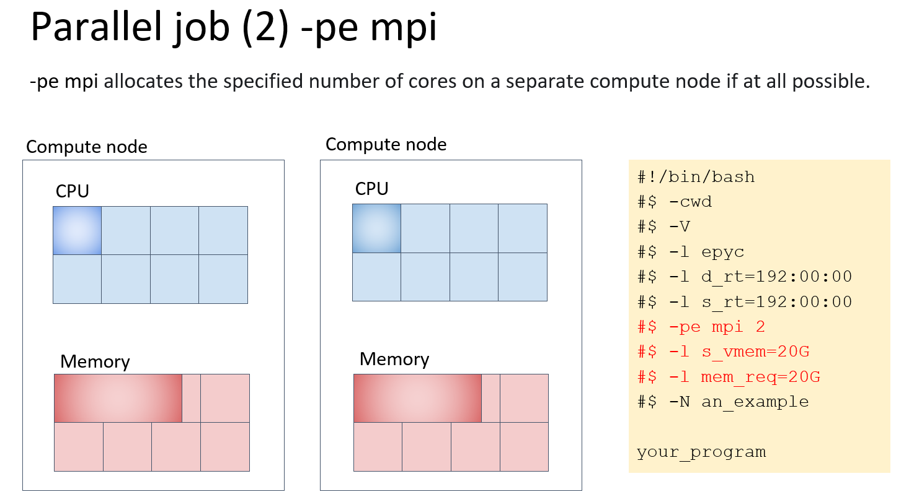
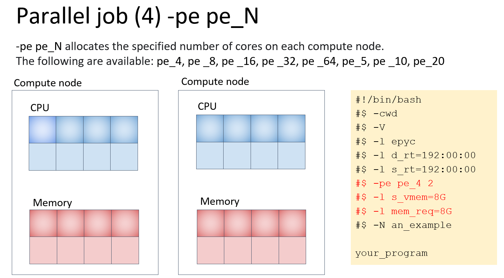

:::danger This is an old document

This document is a former NIG supercomputer (2019) document and is kept for reference purposes.

Please note that it does not work in the same way on the current NIG supercomputer (2025).
:::

When you run a small number of programs that use multiple CPU cores and run for a long time, run them as parallel jobs. (When you execute many jobs, use the array job of parallel jobs.)

To use the parallel job function in addition to the options described in the [Batch Jpbs (batch job)](/guides/software/JobScheduler/Slurm/batch_jobs) page, specify the parallel environment with the `-pe` option.

## Types of parallel jobs (overview) {#paralleljob-type-overview}

Parallel environment types provided by the NIG supercomputer are as follows.

<table>
<tr>
<th width="300">parallel environment</th><th width="300">meaning</th>
</tr>
<tr>
<td>
`def_slot N`
</td>
<td>
N CPU cores are reserved on the same compute node. (When N exceeds the number of CPU cores on the compute node, the job will not start.)
</td>
</tr>
<tr>
<td>
`mpi N`
</td>
<td>
N CPU cores are reserved across multiple compute nodes. At that time, the compute nodes are selected by the round-robin method. As a result, the cores are secured in a form scattered among as many computing nodes as possible.
</td>
</tr>
<tr>
<td>
`mpi-fillup N`
</td>
<td>
N CPU cores are reserved across multiple computation nodes. At that time, the core is secured so that the number of calculation nodes is as small as possible.
</td>
</tr>
<tr>
<td>
`pe_n N` 

The defined parallel environment is as follows.<br/>

`pe_4`, `pe_8`, `pe_16`, `pe_32`, `pe_64`, 

`pe_5`, `pe_10`, `pe_20`
</td>
<td>
N cores are reserved across multiple computation nodes. At that time, n = 4,8,16,… cores are secured on each compute node.
</td>
</tr>
</table>

The number of cores can be specified a range besides a single number.

- ` qsub -pe mpi-fillup 100 -S /bin/bash job_script.sh `
- ` qsub -pe def_slot 20-100 -S /bin/bash job_script.sh `
- ` qsub -pe mpi 20- -S /bin/bash job_script.sh `

### Notes on specifying memory requirements for parallel jobs {#paralleljob-type-overview#note-specify-memory}

When `-l s_vmem` or `-l mem_req` is specified for the parallel job, the job is submitted by requesting memory, which is multiplied by the number of parallels specified in the parallel environment and specified memory from the system.

For example, when you specify as below, it means that you have specified 16 × 8 = 128GB as the total memory used by the parallel jobs. Remember this point and decide requested memory to be specify.

```
-pe def_slot 16 -l s_vmem=8G -l mem_req=8G
-pe mpi-fillup 16 -l s_vem=8G -l mem_req=8G 
```


## Types of parallel jobs (detail) {#paralleljob-type-detail}

### CPU and memory allocation {#paralleljob-type-detail#cpu-and-mem-alloc}

The above example specifies one CPU core and the corresponding memory.

If the amount of memory is not specified when executing the qsub command (default value), e.g. for Thin node Type 1a, 8 GB of memory is allocated per CPU core.
(This depends on the type of computer and the type of queue.)


`def_slot` always allocates the specified number of cores on the same compute node. In the example in the figure below, memory is 20GB per core, a total of 20GB x 2 cores = 40GB  is allocated in one computer.


`mpi` allocates resources as evenly as possible to multiple computers. In the example below, if you specify `mpi 2`, memory is 20GB per CPU core and each computer is allocated 1 core x 20GB = 20GB each, for a total of 20GB x 2 computers = 40GB.



`mpi-fillup` allocates resources to one of the multiple computers as much as possible. If the resource cannot be allocated, it tries to allocate the resource to another computer. This is the difference with `def_slot`. In the example below, if there are two calculators with 64GB memory per calculator, if you specify `mpi-fillup 4`, the memory is 20GB per CPU core, 3 cores x 20GB = 60 GB for one of the two computers, 1 core x 20GB = 20 GB for the other, a total of 20GB x 4 cores = 80GB is allocated.


`pe_N`, if you speify `pe_4 2`, the resources are allocated to two computers with four cores each. In the example in the figure below, memory is 8GB per CPU core, 4 cores x 8GB = 32GB each for each computer, a total of 32GB x 2 computers = 64GB  is allocated.




### How to check which compute nodes have been allocated in a parallel job {#paralleljob-type-detail#check-which-nodes-allocated}

```
$ qstat
job-ID     prior   name       user      state submit/start at     queue   jclass       slots ja-task-ID  
------------------------------------------------------------------------------------------------------
 13862312 0.25410 QLOGIN     you         r     09/25/2021 23:34:49 login.q@at138        1         
 13862486 0.25194 QLOGIN     you         r     09/26/2021 10:15:28 login.q@at139        1         
 13862667 0.25084 QLOGIN     you         r     09/26/2021 15:40:40 login.q@at137        1         
 13862992 0.25039 an_example you         r     09/26/2021 18:54:09 epyc.q@at143         2         
 13862987 0.25020 an_example you         r     09/26/2021 19:44:58 epyc.q@at154         1         
 13862989 0.25040 an_example you         qw    09/26/2021 18:50:50                      2   

$ qstat -j 13862992 | grep exec_host_list
exec_host_list        1:    at143:2     
```


You can see which compute nodes have been allocated from the `exec_host_list` line displayed by `qstat -j <job number>`.
